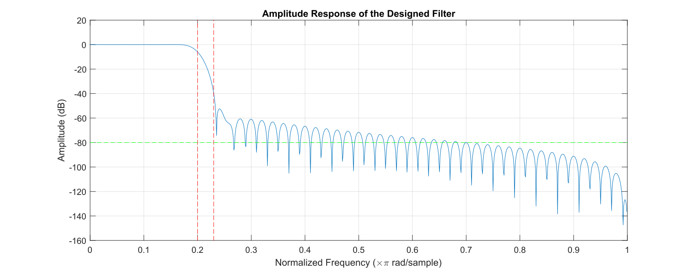
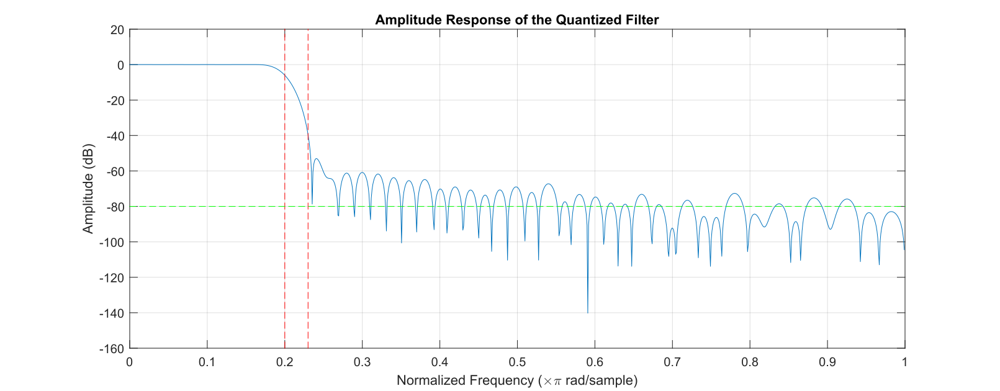

# Project 0: Low-Pass FIR Filter Design and Implementation

## Project Overview

This project aims to design and implement a low-pass FIR filter using MATLAB for filter design and Verilog for hardware implementation. The design criteria include a 100-tap low-pass filter with a transition region from 0.2π to 0.23π rad/sample and a stopband attenuation of at least 80dB. The project explores different FIR filter architectures, including pipelining, reduced-complexity parallel processing, and a combination of both, to achieve efficient hardware implementation.

## Design Process

### Filter Design in MATLAB

In this project, we utilized MATLAB to design a low-pass FIR filter that met stringent specifications. The design goal was to create a 100-tap filter with a transition region from \(0.2\pi\) to \(0.23\pi\) radians per sample and a stopband attenuation of at least 80dB. This was accomplished using MATLAB's `fir1` function with a Hamming window, carefully chosen for its efficacy in filter design. The `fir1` function was parameterized with a cutoff frequency of 0.2 (normalized to the Nyquist frequency), aiming to achieve the desired filter characteristics.

Following the design phase, we conducted a frequency response analysis using MATLAB's `freqz` function. This step was crucial for ensuring that the filter's performance adhered to the specified stopband attenuation criteria. Upon confirming that the filter met these requirements, we proceeded with the quantization of the filter coefficients to fit the Q15 format. This format is widely used in digital signal processing for representing fixed-point numbers, making it ideal for our hardware implementation phase. The quantization process involved scaling the coefficients by \(2^{15}\), followed by rounding and clamping the values to match the Q15 representation constraints.

Fig. 1 and Fig. 2 show the amplitude response of our design filter and quantized filter.

Figure 1: Amplitude response

Figure 2: Quantized amplitude response

### HDL Implementation

#### Direct Form FIR Filter
