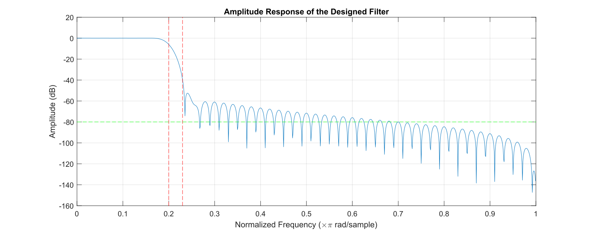
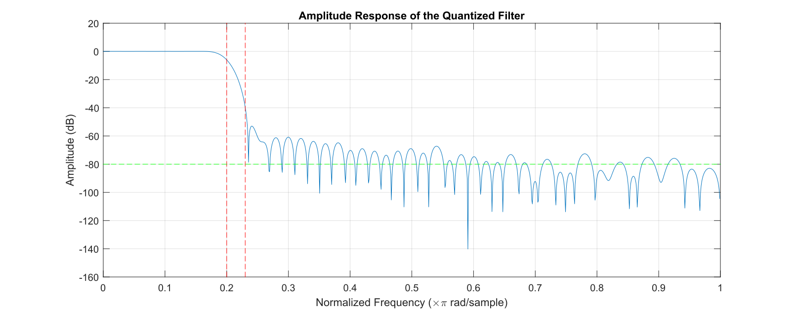
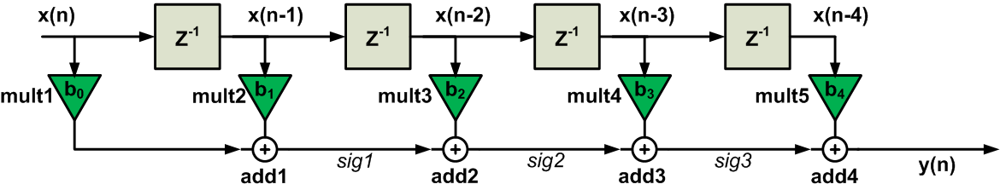
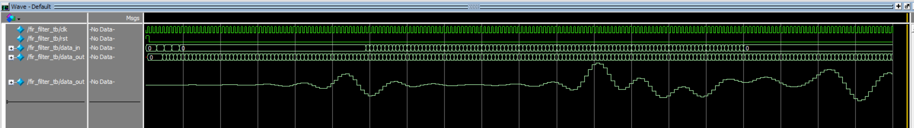
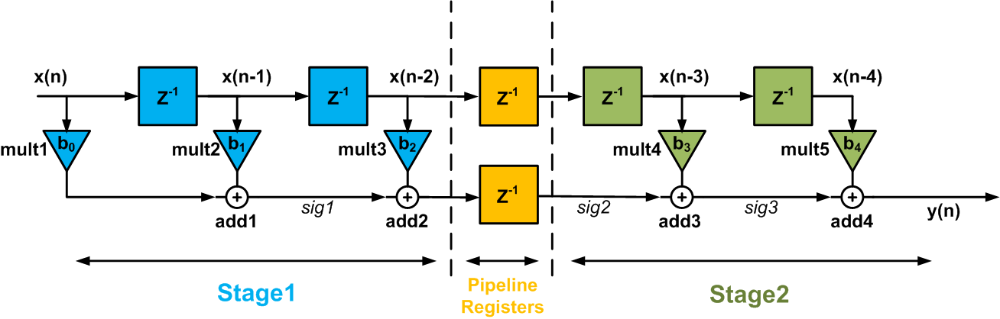
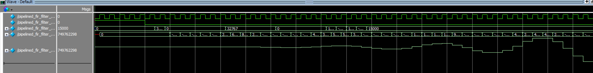

# Project 0: Low-Pass FIR Filter Design and Implementation

## Project Overview

This project aims to design and implement a low-pass FIR filter using MATLAB for filter design and Verilog for hardware implementation. The design criteria include a 100-tap low-pass filter with a transition region from 0.2π to 0.23π rad/sample and a stopband attenuation of at least 80dB. The project explores different FIR filter architectures, including pipelining, reduced-complexity parallel processing, and a combination of both, to achieve efficient hardware implementation.

## Design Process

### Filter Design in MATLAB

In this project, we utilized MATLAB to design a low-pass FIR filter that met stringent specifications. The design goal was to create a 100-tap filter with a transition region from \(0.2\pi\) to \(0.23\pi\) radians per sample and a stopband attenuation of at least 80dB. This was accomplished using MATLAB's `fir1` function with a Hamming window, carefully chosen for its efficacy in filter design. The `fir1` function was parameterized with a cutoff frequency of 0.2 (normalized to the Nyquist frequency), aiming to achieve the desired filter characteristics.

Following the design phase, we conducted a frequency response analysis using MATLAB's `freqz` function. This step was crucial for ensuring that the filter's performance adhered to the specified stopband attenuation criteria. Upon confirming that the filter met these requirements, we proceeded with the quantization of the filter coefficients to fit the Q15 format. This format is widely used in digital signal processing for representing fixed-point numbers, making it ideal for our hardware implementation phase. The quantization process involved scaling the coefficients by \(2^{15}\), followed by rounding and clamping the values to match the Q15 representation constraints.

Fig. 1 and Fig. 2 show the amplitude response of our design filter and quantized filter.

Figure 1: Amplitude response

Figure 2: Quantized amplitude response

### HDL Implementation

#### Direct Form FIR Filter

Figure 3: Illustration of direct form FIR filter ([Source](https://www.allaboutcircuits.com/technical-articles/pipelined-direct-form-fir-versus-the-transposed-structure/))

Fig. 3 represents the flow of data through the filter stages. The input signal \( x(n) \) is sequentially delayed by the delay elements \( Z^{-1} \), creating a set of temporally spaced samples: \( x(n), x(n-1), x(n-2), \ldots \). Each of these samples is then multiplied by a corresponding filter coefficient (\( b_0, b_1, b_2, \ldots \)) in the multiplier units \( mult1 \) to \( mult5 \). The products of these multiplications are then summed in the adder units \( add1 \) to \( add4 \), generating the output \( y(n) \).

The Verilog implementation closely follows the illustrated architecture, with each stage of the filter represented within the code structure. The delay elements are realized using a shift register array, the multiplication by coefficients is performed within generated multiplication statements, and the accumulative sum is computed in a sequential always block triggered by the rising edge of the clock signal.

Our testbench includes several simulated cases:

1. **Step Function**: Input toggles between maximum positive and negative values to test the filter's response to sudden changes in signal level.
2. **Sinusoidal Input**: A 1 Hz sine wave is applied, testing the filter's ability to process periodic signals.
3. **Random Noise**: Random values simulate noisy conditions, allowing us to observe the filter's performance in the presence of unpredictability.
4. **Impulse**: A single impulse checks the filter's impulse response, a fundamental characteristic of FIR filters.

Figure 5: Waveform of the direct form FIR Filter

Fig. 5 shows the waveform response of the direct form FIR filter.

#### Pipelined FIR Filter

Figure 6: Illustration of pipedlined FIR filter ([Source](https://www.allaboutcircuits.com/technical-articles/pipelined-direct-form-fir-versus-the-transposed-structure/))

To enhance the performance of the FIR filter, a pipelined architecture was implemented, as Fig.6 shows. The filter is segmented into two processing stages, with pipeline registers strategically placed between them. These registers serve as buffers, enabling simultaneous operations on consecutive sets of data across different stages each clock cycle. 

In Stage 1, input data undergo the initial multiplication and addition operations. The results are then stored in the pipeline registers, ensuring that the computation's intermediate state is preserved while the next set of input data enters Stage 1. This approach allows Stage 2 to concurrently process the next phase of computation, thus maximizing the filter's throughput. 

The pipelined FIR filter structure effectively increases the data processing rate, a crucial feature for high-frequency applications where latency and speed are of paramount importance. The visualization succinctly demonstrates the data flow and the role of pipelining in optimizing the filter's performance.

The testbench for the pipelined FIR filter, `pipelined_fir_filter_tb`, is structured to validate the functionality of the filter across a range of inputs, ensuring that the filter operates correctly through various signal scenarios. This testbench stimulates the `pipelined_fir_filter` with an impulse, a step, and a series of random signals, which are fundamental tests for assessing the behavior of digital filters.

We have following test cases:

1. **Impulse Response**: An impulse is input to the filter to observe the propagation of the coefficients through the pipeline stages. This is a critical test that effectively validates the transfer function of the filter.
   
2. **Step Response**: A step input is applied, and the filter's output ramp-up is monitored. This test reveals the filter's transient response and settling time.
   
3. **Random Signal Input**: A sequence of predetermined random values is fed into the filter, testing its ability to handle varying signal patterns. This test helps in analyzing the filter's stability and linearity with more complex inputs.

Figure 7: Pipelined FIR filter waveform

Fig. 7 shows the waveform of the pipelined FIR filter.